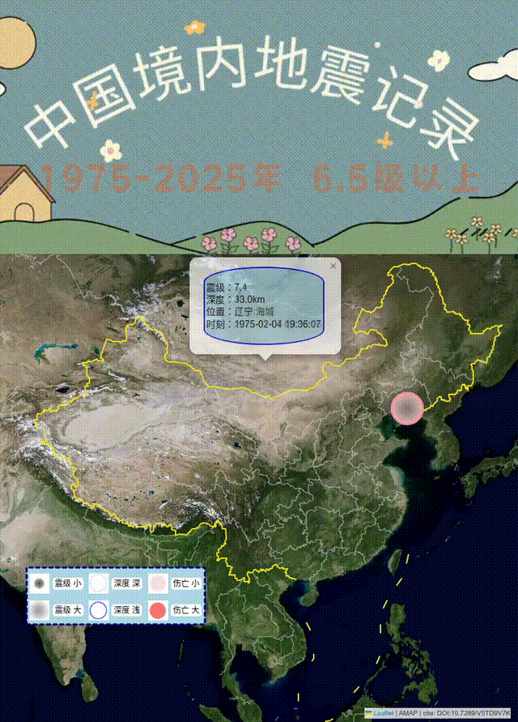

# Earth Quake

## Introduction
Displays historical sequence of large earthquake information.

## Function
- Download the earthquake data from the Internet and fix it; 
- Use the folium module to poll and display earthquake information;
- Use the Flask framework to build a web server to display the data.

```commandline
python3 run.py
```

Web address:
http://127.0.0.1:5000/

  

## Require:
pandas  
folium  
dash  

In the folium module, when use TimestampedGeoJson, the popup can not autopopup, must adjust the popup open time in the TimestampedGeoJson.  

## Description of Deaths
0	None  
1	Few (~1 to 50 deaths)  
2	Some (~51 to 100 deaths)  
3	Many (~101 to 1000 deaths)  
4	Very many (over 1000 deaths)  

## Description of data

中国大陆境内地震信息统计

中国大陆境内1975年-2025年发生的6.5级（含）以上地震信息统计：  
共记录次数：26次 

震级统计：  
6.5-7.0级（不含）：12次  
7.0级（含）以上：14次  
最高：7.9级，汶川地震  

位置统计：  
东北：3次（辽宁/河北）  
西北：11次（主要新疆/青海/甘肃）  
西南：12次（主要西藏/四川/云南）  

连续发生地震：  
1976-05-29：云南龙陵连续发生两次地震（7.3级/7.4级）  
1976-07-28：河北唐山连续发生两次地震（7.5级/7.4级）  

高频区域：  
青藏高原：位于印度板块和亚欧板块碰撞带上，地壳活动剧烈。  
四川盆地及周边：龙门山断裂带为主要地震带。  
新疆地区：天山、昆仑山等活动断裂带频发大地震。  
云南及西南地区：受印度板块推挤影响，地震活动较多。  
台湾：位于太平洋板块与亚欧板块交界处。  

地震空区：  
东北平原、中原地区等区域地壳相对稳定，6.5级以上地震较少。  

注：  
以上信息统计不包含港、澳、台的数据。  
Datasource: cite: DOI:10.7289/V5TD9V7K  
